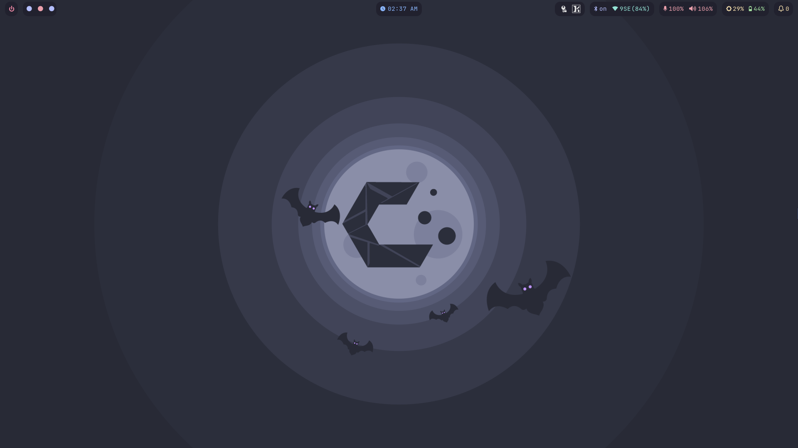
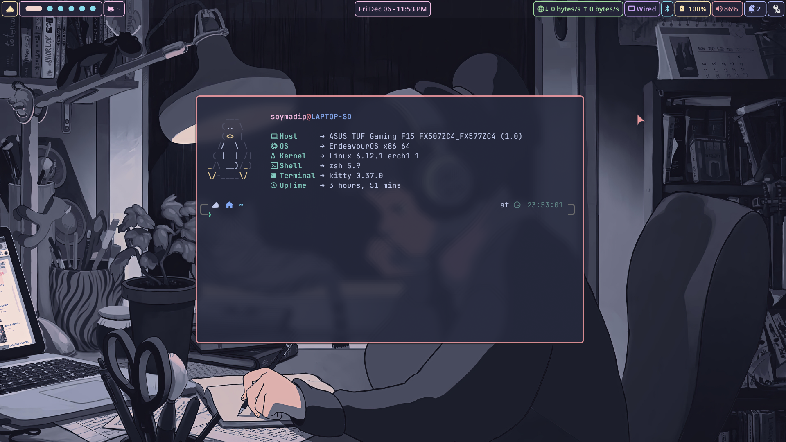
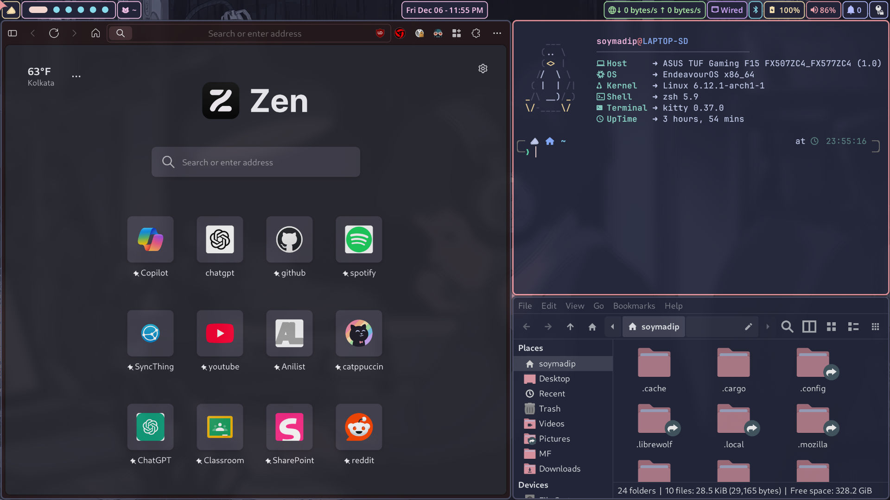

<!-- -------- Header start --------- -->

<div align="center">
  <br>
  <h1 style="color:#f594a0">
    ⚙️ MyDE 🔧
  </h1>
  <p><em>A beautiful, customized Linux Desktop Environment featuring Hyprland as wm, & carefully curated set of services.</em></p>
</div>

<br>

<h2 align="center">-----: ScreenShots :-----</h2>

<div align="center">
  <div>
    
  </div>
  <div>
    
    
  </div>
</div>

<br>

<h2 align="center">-----: Setup Overview :-----</h2>

```zsh
> fastfetch
```


```yaml
 soymadip@DESKTOP-SD
 ---------------------
 OS: Arch Linux
 Kernel: 6.16.10-arch1-1
 Packages: 1051(pacman), 2 (flatpaks)
 Shell: zsh
 WM: Hyprland
 Theme: Catppuccin Macchiato-maroon [QT],[GTK3/4]
 Icons: Papirus-Dark [QT],[GTK3/4]
 Terminal: Kitty
 Terminal Font: JetbrainsMono Nerd Font 12
 CPU: 12th Gen Intel(R) Core(TM) i5-12500H (16) @ 4.50 GHz
 GPU1: Intel(R) UHD Graphics (128.00 MiB) [Integrated]
 GPU2: NVIDIA GeForce RTX 3050 (3.87 GiB) [Discrete]
 Memory: 2.40 GiB / 15.63 GiB
```

<br>

<h2 align="center">-----: App Utilities :-----</h2>

<details>
  <summary>GUI Apps</summary>

- **WezTerm --** Default _Terminal_ App.
- **Dolphin --** _File Manager_.
- **Okular --** Document Viewer.
- **vicinae --** Raycast inspired Application launcher.
- **KDE Connect --** Control PC from your Android.
- **Disks --** Gnome _Disk utility_.
- **VS Code --** FOSS Fork of VS Code without **telemetry**.
- **Obsidian --** "Second Brain" for Note Taking.
- **LibreOffice --** Open Source Office Utility.
- **Zen Browser --** web browser built on top of Firefox, focusing on faster, more secure, and beautifully customizable browsing experience.
- **Firefox PWA --** Workarround for Firefox's [No PWA support](https://9to5google.com/2021/01/27/firefox-discontinues-work-pwa-desktop/) crap.
- **Brave --** Chromium based Privacy focused Browser.
- **MPV Player --** The Command line video player.
- **Kasts --** Podcast Player.
- **64gram --** Unofficial Telegram client with many customizations.
- **KeepassXC --** Offline Password manager.
- **Kvantum --** QT & GTK svg theme engine.
- **NWG look --** DE independent gtk theme manager.
- **OBS Studio --** FOSS software for video recording and live streaming.
- **rofi --** Window switcher, application launcher and dmenu replacement.
- **WebCord --** A Discord and SpaceBar electron based client implemented without Discord API.
- **Ktorrent --** Excellent Torrent Client.

</details>

<details>
  <summary>CLI  Apps</summary>

- **Paru --** AUR helper.
- **Git --** The version control system.
- **LazyGit --** Nice TUI for git.
- **zsh --** My login Shell
- **Nu Shell --** The modern Shell
- **yazi --** Terminal file manager.
- **zathura --** lightweight document viewer.
- **NeoVim --** [Vim](<https://en.wikipedia.org/wiki/Vim_(text_editor)>) with lua support.
- **Stow --** Utlity to easily symlink configs.
- **Yt-dlp --** Download video from [1000+](https://github.com/yt-dlp/yt-dlp/blob/master/supportedsites.md) websites.
- **eza --** Rewrite of GNU `ls` with lots of added features like colors, icons etc.
- **bottom --** A customizable cross-platform process monitor for terminal.
- **btop++ --** System Monitor.
- **fzf --** A command-line fuzzy finder.
- **Syncthing --** File sync between devices.
- **fastfetch --** Neofetch written in C.
- **QT5ct --** Qt5 Configuration Tool.
- **QT6ct --** Qt6 Configuration Tool.
- **GrimBlast --** ScreenShot Utility.

</details>

<details>
  <summary>Hyprland Utils</summary>

- **Hyprpicker --** Wayland color picker that does not suck.
- **Hyprpaper --** Wallpaper utility.
- **HyprPanel --** Community maintained Status Bar based on ags.
- **Hypridle --** Hyprland screen idle manager.
- **Hyprlock --** Hyprland's GPU-accelerated screen locking utility

</details>

<details>
  <summary>Some useful Projects</summary>

- **📱 Waydroid -** A container-based approach to boot a full Android system on Linux (alternative to `WSA`).
- **📱 srccpy -** Display and control your Android device.
- **📱 guiscrcpy -** Open Source GUI based Android Screen Mirroring System.
- **🔤 NerdFont -** Beautiful Font with icon support.

</details>

<br>
<!-- -------------------------- -->

<h2 align="center">-----: Keyboard Shortcuts :-----</h2>

I try to stick to some basic rules for my binds :-

- `Super` : Dedicated to window management and global system related things.
- `Ctrl + Shift` : Reserved for application-specific actions or shortcuts.
- `Ctrl` : Used for internal functions within apps (e.g., terminal commands or CLI interactions).
- `Alt` : For any extra work or alternate actions.

<br>

**For List of all keybinds** :-

1. Press `Super + /` in a MyDE installation.
2. A written list can be found [here](https://soymadip.github.io/MyDE/keybinds/).

</br>

<h2 align="center">-----: ⚠️ :-----</h2>

- Various functions of MyDE depends on various scripts, utils. Removing any of them may break some functionality.<br>
  So DO NOT TRY TO CHANGE THINGS MANUALLY unless you know what you are doing.
- Install script is not yet totally ready, I am working on it's [dependency library](https://soymadip.github.io/KireiSakura-Kit) which is pretty close to being workable.

</br>

<h2 align="center">-----: 🙏 Thanks to :-----</h2>

- Vaxry for [Hyprland](https://hypr.land).
- Aurélien Brabant for [Vicinae](https://github.com/vicinaehq/vicinae).
- Alexays for [waybar](https://github.com/Alexays/Waybar).
- adil090x for [rofi theme](https://github.com/adi1090x/rofi) base.
- Keyitdev for [sddm](https://github.com/Keyitdev/sddm-astronaut-theme) theme.
- soymadip for [KireiSakura-Kit](https://soymadip.github.io/KireiSakura-Kit). :)
